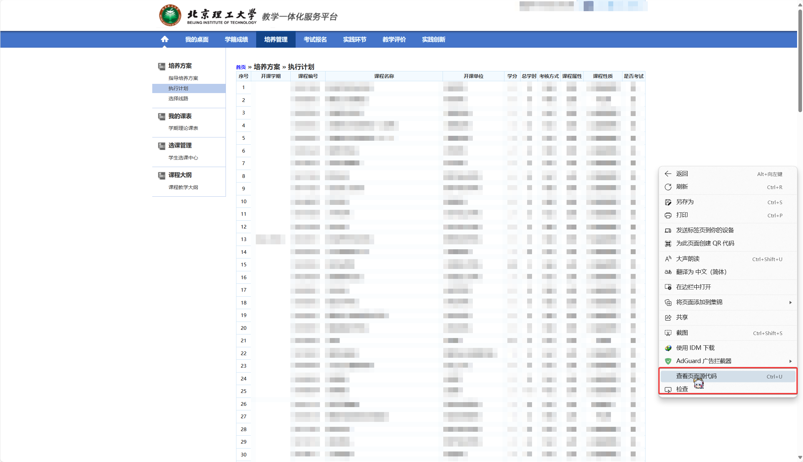
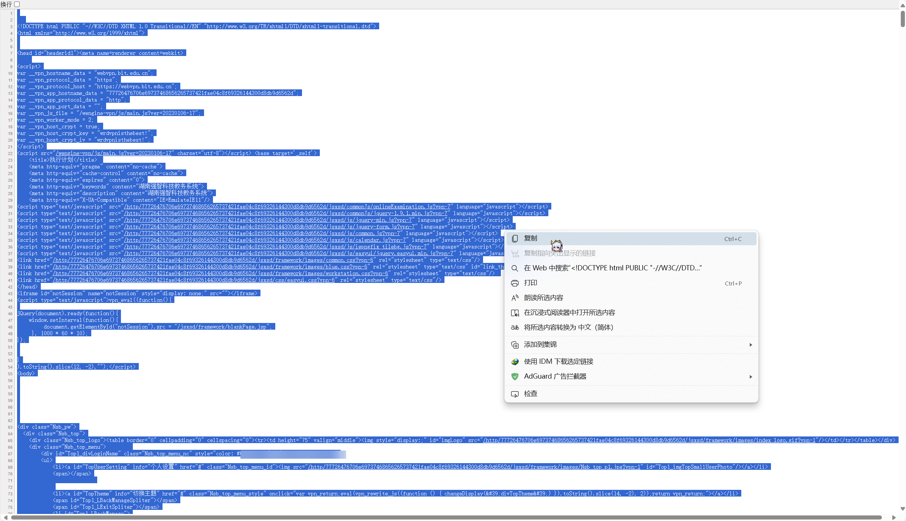

# BIT_Course_structure_to_Excel

将北京理工大学的培养方案页转换为excel
converting the website of BIT course structure to Excel
由于作者不会写带有认证的爬虫，所以需要手动获取HTML源码
you should manually get HTML source code since the author havn't learnt the way to spider it with authentication

***
## 使用步骤（How to use)：
1. 下载本项目源码或使用git运行：

download the source code or run the following command with GIT:

`git clone https://github.com/guanosine-diphosphate/BIT_Course_structure_to_Excel.git`

2. 确保已经正确安装~~屁眼通红~~Python，在项目路径下（若第一步使用git，则运行

`cd BIT_Course_structure_to_Excel`

enter the project path with the command above or any method else if you want

进入路径）运行：

then run

`pip install -r requirements.txt`

to install the dependence
3. 进入培养方案页，右键空白处，在右键菜单中点击“查看网页源代码”或类似选项

enter the page for your course structhre, right click somewhere empty and click "view source code of the page" or something similar

复制新窗口中的所有内容

copy everything in the popped page

在`html.txt`中粘贴

paste them in `html.txt`

4. 运行main.py,在项目根目录中获得`培养方案.xlsx`

run main.py and generate the excel file in the root path of this project. The file name is in Chinese, but I believe you can manually modify this.

***

十分令人遗憾的是，使用`pyinstaller`生成的exe文件十分巨大且无法正常运行，因此本项目将来大概率不会发布Release

It's a pity that the EXE file generated with `pyinstaller` appers to be extremely gigantic, and the file generated didn't work as expected. So `Release` is unlikely to be published in the future.